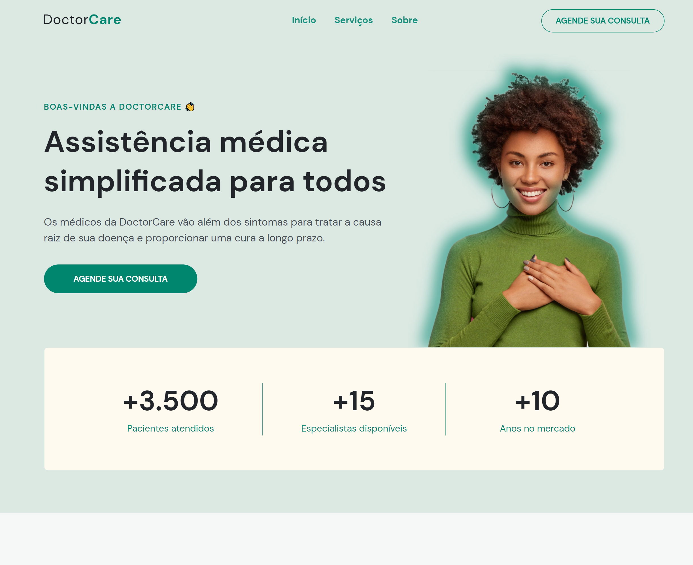

# SITE DOCTORCARE - NLW 2022

Site criado no evento NLW de Maio/2022, onde foi criado uma landing page de um site de assistências médicas. A landing page conta com uma introdução do que se trata o site, uma seção de serviços, uma seção de sobre a empresa e finaliza com uma seção de contatos.

[Clique aqui para acessar](https://melissabilher.github.io/sitenlw2022/)

## 🛠 Tecnologias

- HTML
- CSS
- JavaScript
- Git e Github

